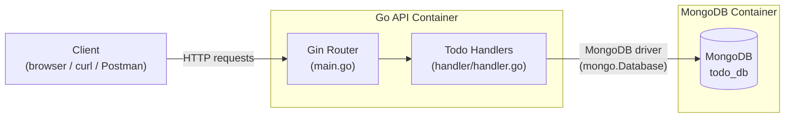
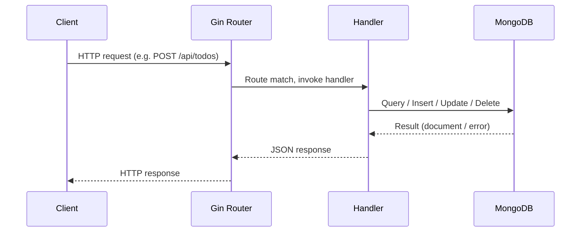
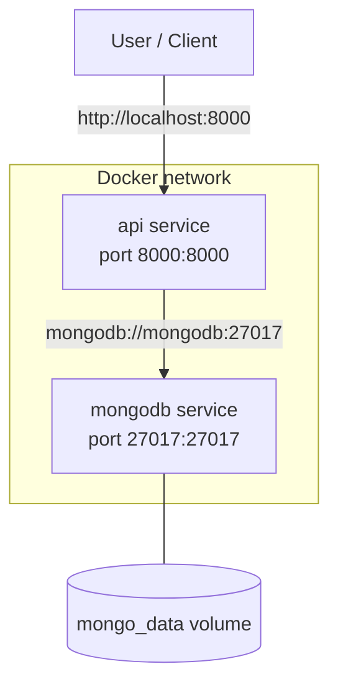

# Architecture

## Overview

The API follows a simple, layered architecture: an HTTP layer (Gin), a handler
layer that contains the business logic, and MongoDB as the persistence layer.

## Request lifecycle

## Components

| Component      | Responsibility                                                        |
| -------------- | ----------------------------------------------------------------------|
| `main.go`       | Bootstraps the app: loads config, connects to MongoDB, registers routes, starts the HTTP server. |
| `handler/`      | Contains the `Todo` model and the HTTP handlers implementing CRUD operations. |
| MongoDB         | Stores `Todo` documents in the `todos` collection, inside the `todo_db` database. |

## Connecting to MongoDB

The connection is established once at startup via the official
[MongoDB Go Driver](https://www.mongodb.com/docs/drivers/go/current/):

1. `main.go` reads the connection settings from environment variables
   (`MONGO_URI`, `MONGO_DB`), falling back to sane defaults for local
   development.
2. A `mongo.Client` is created and a `Ping` is issued to verify connectivity
   before the HTTP server starts accepting traffic.
3. The resulting `*mongo.Database` handle is passed into every handler so
   each request can access the `todos` collection.

This keeps the database connection pooled and reused across requests instead
of opening a new connection per request.

## Deployment topology (Docker Compose)

